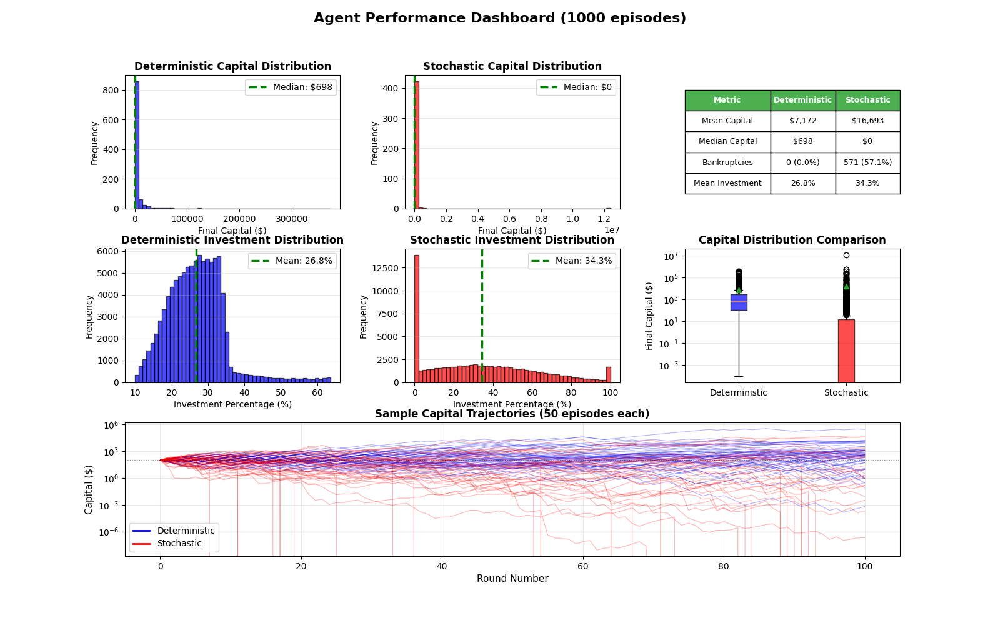
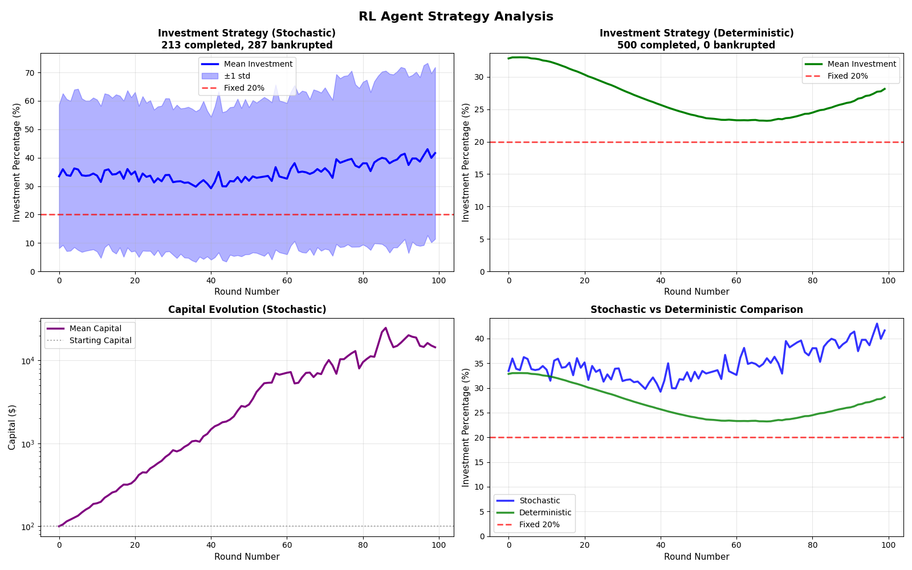

# RL Investment Strategy Optimisation
A reinforcement learning approach to finding optimal investment strategies in a simulated betting game with known probabilities.

## The Problem
Setup:
- Starting capital: $100
- Number of rounds: 100
- Win probability: 60%
- Loss probability: 40%
- Returns: 1:1 on invested amount

Goal: Determine the optimal percentage of capital to invest each round to maximise final capital.

## Theoretical Background
The Kelly Criterion suggests the optimal fixed investment percentage for this setup is:
```
Kelly % = (win_prob - loss_prob) / 1 = (0.6 - 0.4) = 20%
```

However, a *dynamic* strategy that adapts based on current capital and round number could potentially outperform a fixed 20% strategy.

## Why Reinforcement Learning?
PPO (Proximal Policy Optimization) was chosen because:
- Continuous action space: Investment percentage (0-100%)
- Episode-based learning: Natural fit for 100-round games
- Stability: PPO's clipped objective prevents destructive policy updates
- Sample efficiency: Learns from each episode multiple times

## Reward Structure
The reward function balances multiple objectives:

Per-round rewards:
```python
# Base: Percentage capital growth
reward = (capital_change / old_capital) * 10

# Kelly guidance: Bonus for investing near 20%
if 15% <= investment <= 25%:
    reward += 0.5

# Penalties for extremes
if investment < 5%: reward -= 0.8   # Too conservative
if investment > 50%: reward -= 1.0  # Too aggressive

# Progress bonus
reward += 0.03  # Encourages survival
```

Terminal rewards:
```python
# Completion bonus (round 100)
reward += log(final_capital / initial_capital) * 8 + 20

# Early bankruptcy penalty
penalty = -25 * (1 - rounds_survived / 100)
```

## Results

### Agent Performance

Deterministic Evaluation:
- Mean investment: 26.8% (close to Kelly optimal)
- Median final capital: $698
- Completion rate: 100% (0 bankruptcies)

Stochastic Evaluation:
- Mean investment: 34.3% (more exploratory)
- Mean final capital: $16,693 (high variance, some huge wins)
- Bankruptcy rate: 57.1% (high-risk, high-reward)

### Investment Strategy Evolution


Key observations:
- Deterministic policy converges to ~25-30% investment (near optimal)
- Strategy adaptation: Slight increase in investment percentage in later rounds
- Capital growth: Consistent exponential growth in deterministic mode
- Stochastic exploration: Samples from wider distribution, leading to both massive gains and bankruptcies

## Comparison with Baselines
| Strategy | Median Capital | Bankruptcies |
|:--------:|:--------------:|:------------:|
| Fixed 20% (Kelly) | ~$750 | 0% |
| RL Agent (Deterministic) | $698 | 0% |
| RL Agent (Stochastic) | $0 | 57% |

The RL agent's deterministic policy performs comparably to the Kelly Criterion while learning purely from experience, validating the approach.

## Technical Details
Environment:
- Custom Gymnasium environment
- Observation space: [normalized capital, normalized round]
- Action space: Continuous [0, 1] (investment percentage)

Training:
- Algorithm: PPO (Stable-Baselines3)
- Training steps: 2,000,000
- Parallel environments: 32
- Entropy coefficient: 0.005 (low exploration)
- Learning rate: 3e-4

## Usage
```python
# Train a new model
model = PPO("MlpPolicy", env, ent_coef=0.005, ...)
model.learn(total_timesteps=2_000_000)

# Evaluate
model = PPO.load("model_name")
obs, info = env.reset()
action, _ = model.predict(obs, deterministic=True)
```

## Key Learnings
1. **Reward design is critical**: Early versions with sparse rewards failed to learn
2. **Deterministic vs. stochastic evaluation**: Stochastic policy explores more but risks bankruptcy
3. **Kelly Criterion emerges**: Agent converges to ~27% without explicitly being told the optimal strategy
4. **Per-step feedback essential**: Dense rewards (every round) worked far better than sparse (only at end)


---
*Built with Python, Gymnasium, Stable-Baselines3, and lots, like l-o-t-s, of trial and error.*
